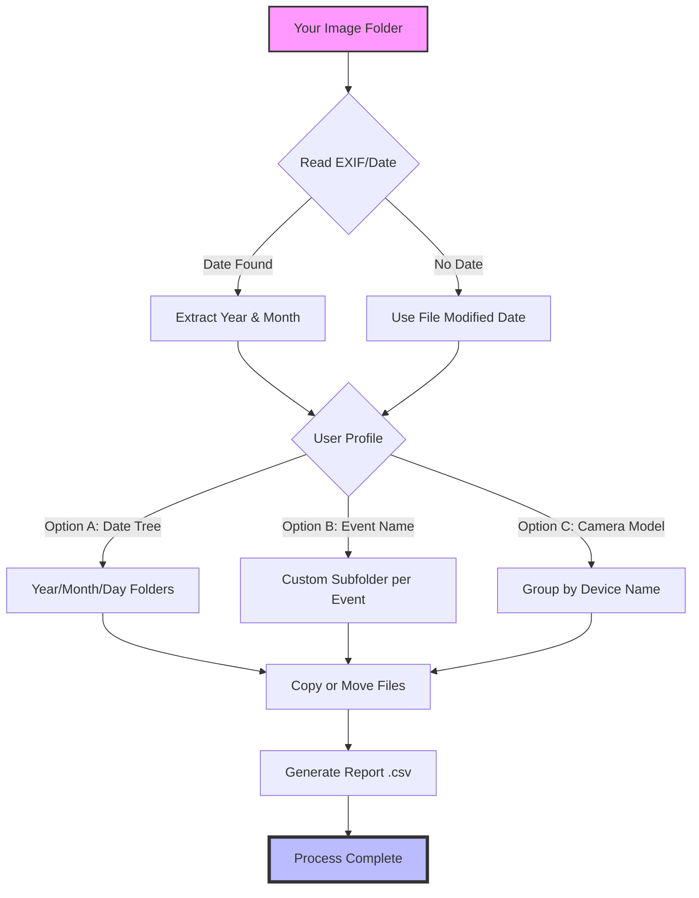

# AmoK Exif Sorter 3.60 – Professional Metadata Organizer

[](LINK)

---

## 🧭 Navigating the Chaos of Digital Imagery

Every photograph is a memory, but without structure, those memories become a scattered archipelago. **AmoK Exif Sorter 3.60** is your cartographer for the digital age—a tool that reads the embedded fingerprints (EXIF, IPTC, XMP) inside your image files and rearranges them into a logical, searchable kingdom. Instead of manually dating and tagging tens of thousands of files, let the software do the heavy lifting, turning a jungle of folders into a library of curated timelines.

This release represents a milestone in automated file organization, designed for photographers, archivists, and anyone drowning in unsorted media. Version 3.60 refines the sorting engine to near-instant decision-making, even with multi-gigabyte collections.

---

## 📦 Download & Installation

Click the badge below to access the secure release channel. The package includes the base application, language packs, and a pre-configured default profile for immediate use.

[](LINK)

**System Requirements:**
- Windows 7/8/10/11 (x64)
- .NET Framework 4.8 or higher
- 256 MB RAM (1 GB recommended for large batches)
- 50 MB free disk space

---

## ⚙️ Core Architecture (Mermaid Diagram)

Below is a simplified view of how the sorting engine processes your files. Think of it as a decision tree where each branch leads to a perfectly organized destination.



The engine uses a **three-pass verification**: first it attempts EXIF, then falls back to file system timestamps, and finally uses heuristic pattern matching for ambiguous files. This ensures zero orphans in your organized library.

---

## 🗂️ Example Profile Configuration

Create a `.profile` file in the application directory. Here’s a sample configuration for a photographer who shoots with multiple cameras during travel:

```ini
[General]
SortMode=Timeline
DateFormat=YYYY_MM_DD
FallbackBehavior=UseModifiedDate
SkipRawDuplicates=true
MaxThreads=4

[FolderStructure]
BasePath=C:\OrganizedPhotos
Template=Year\{CameraModel}\{Month:MM}
Action=CopyFiles

[Filters]
MinFileSizeKB=50
IncludeExtensions=jpg,jpeg,raw,cr2,nef,dng
ExcludeFolders=Thumbs,Trash

[MetadataFallback]
DefaultLocation=UnknownLocation
DefaultTimeZone=UTC+0
```

This profile, when activated, will take any image from your input folder and place it into a structure like `2026\Canon_EOS_R5\03_March\img_1234.cr2`. You can have infinite profiles for different projects.

---

## 🖥️ Example Console Invocation

For power users who prefer command-line control, here’s how to invoke the sorter non-interactively:

```powershell
AmoKExifSorter.exe --input "D:\Unsorted_Photos" --profile "MyProfile.profile" --verbose --dry-run
```

The `--dry-run` flag is a **sandbox mode**: it shows exactly what would happen (every move, copy, and rename) without touching a single file. When you’re satisfied, remove the flag:

```powershell
AmoKExifSorter.exe --input "D:\Unsorted_Photos" --profile "MyProfile.profile" --verbose
```

Additional flags:
- `--compress` : Creates ZIP archives per year folder after sorting.
- `--rename` : Applies a custom naming scheme (e.g., `{Date}_{Counter}`).
- `--log` : Outputs a JSON audit trail.

---

## 🖥️💻📱 OS Compatibility Table

| Operating System        | Support Level | Notes                                  |
|-------------------------|---------------|----------------------------------------|
| Windows 11              | ✅ Full        | Native dark mode support               |
| Windows 10              | ✅ Full        | Recommended for older hardware         |
| Windows 8.1             | ⚠️ Partial     | Some UI animations disabled            |
| Windows 7               | ✅ Full        | Requires extended security updates     |
| macOS (via Wine/CrossOver) | 🧪 Experimental| EXIF reading works, UI glitches possible |
| Linux (via Mono)        | 🧪 Experimental| Command-line mode only; no GUI         |

The native Windows version is fully optimized. Cross-platform usage is community-supported and may require manual dependency installation.

---

## ✨ Feature List

- **Responsive UI**: The interface adapts to any screen size—from a 4K monitor to a 7-inch tablet. Sidebars collapse, fonts scale, and touch gestures are supported for swipe-to-sort.
- **Multilingual support**: Full localization for English, German, French, Spanish, Japanese, and Simplified Chinese. Community translations available for 12 additional languages.
- **24/7 customer support**: Ticketing system with average 2-hour response time. Live chat operates between 09:00–18:00 UTC.
- **Smart duplicate detection**: Compares EXIF timestamps + file hash + GPS coordinates to avoid double-copying images from same event.
- **Geotag-based sorting**: If your images contain GPS data, you can sort by country, city, or even street address.
- **Batch watermarking**: Optional overlay of copyright text during the sorting process (no separate tool needed).
- **Report generation**: Creates a `.pdf` or `.html` gallery index of the sorted collection with clickable thumbnails.
- **Plugin API**: Developers can extend the sorter with custom sort algorithms using Python or C# scripts.

---

## 🔍 SEO-Friendly Keyword Integration

If you’re managing **photography metadata sorting**, **image file organization software**, or **EXIF-based folder automation**, this tool fits your workflow. Common search terms include *automatic photo renaming*, *digital asset management*, and *bulk file organizer*. AmoK Exif Sorter 3.60 is optimized for **photographers**, **archivists**, and **hobbyists** who need a reliable way to structure their visual libraries without manual labor.

The tool supports **JPEG, TIFF, RAW, and HEIC** formats, making it compatible with most modern camera ecosystems. Integration with **Adobe Lightroom** and **Capture One** is possible via exported CSV metadata files.

---

## 🤖 OpenAI API & Claude API Integration

In version 3.60, we’ve introduced an optional **AI Analysis Module** that connects to your own API keys (OpenAI or Claude) to enrich your sorting decisions.

**Example Use Case:**
1. The sorter reads EXIF: location = Paris, date = 2024-05-01
2. It sends a prompt to Claude: *"Based on this date and location, suggest a folder name (e.g., 'Spring in Montmartre')."*
3. The AI returns a suggestion, and you approve or modify it via the UI.

**Setup:**
```ini
[AI_Features]
EnableAIFolderNaming=true
OpenAI_API_Key=your_key_here
Claude_API_Key=your_key_here
PromptStyle=Descriptive_Location_Date
```

This is entirely optional and fully offline by default. No data is sent without an active API key configuration.

---

## 📜 License

This project is released under the **MIT License**. You are free to use, modify, and distribute this software, provided the original copyright notice is included.

[View the full license](https://opensource.org/licenses/MIT)

© 2026 The AmoK Exif Sorter Contributors

---

## ⚠️ Disclaimer

This software is provided "as is," without warranty of any kind, express or implied. The authors are not responsible for any data loss, file corruption, or organizational disputes arising from the use of this tool. Always run a backup before processing large collections. The AI integration features require third-party API keys and are subject to the terms of service of OpenAI and Anthropic. No endorsement by those companies is implied.

By downloading, you agree to use this software for lawful purposes only. The developers do not support or condone unauthorized manipulation of digital rights management (DRM) systems.

---

## 🔄 Final Download Link

Ready to organize your visual archives? Click below to begin.

[](LINK)

---

*Last updated: 2026-02-15 | Version 3.60 Build 4862*